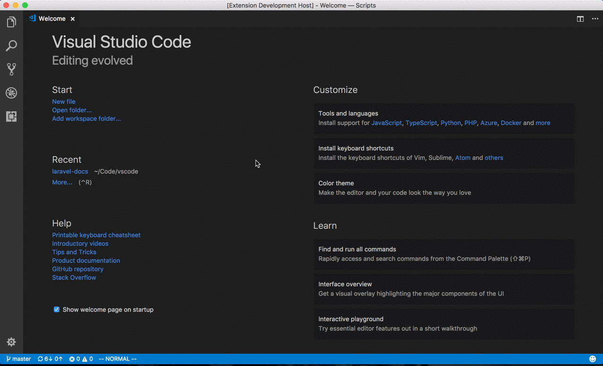

# VSCode Laravel Docs

Open Laravel documentation pages directly from the command palette.

## Features

To use this extension, use `⌘ + Shift + P` on macOS or `Ctrl + Shift + P` on Windows or Linux and start searching for "Laravel Docs" or the specific topic you're after. Choose your docs page and it will open in your default browser!

### Example Usage


## Configuration

To use a specific version of Laravel in URLs, use this configuration option in your User Preferences file, or use the "Change Version" command from the command palette:

```
"laravelDocs.version": 11.x
```

**Important:** After modifying the `laravelDocs.version` configuration value, you need to *reload Visual Studio Code* for the changes to take effect.


## Release Notes

### 1.4.0

- Add "Change Version" command to the command palette to allow setting the version without manually going to user preferences.

### 1.3.0

Added `laravelDocs.version` configuration option to specify Laravel version.

### 1.0.0

Initial release -- Laravel 5.5 support
